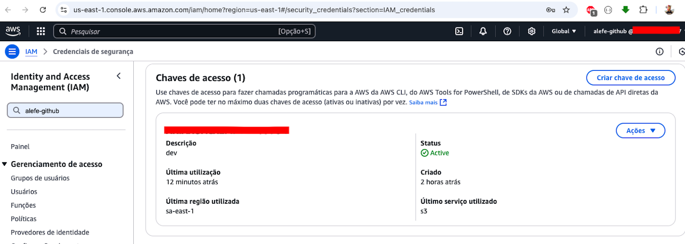
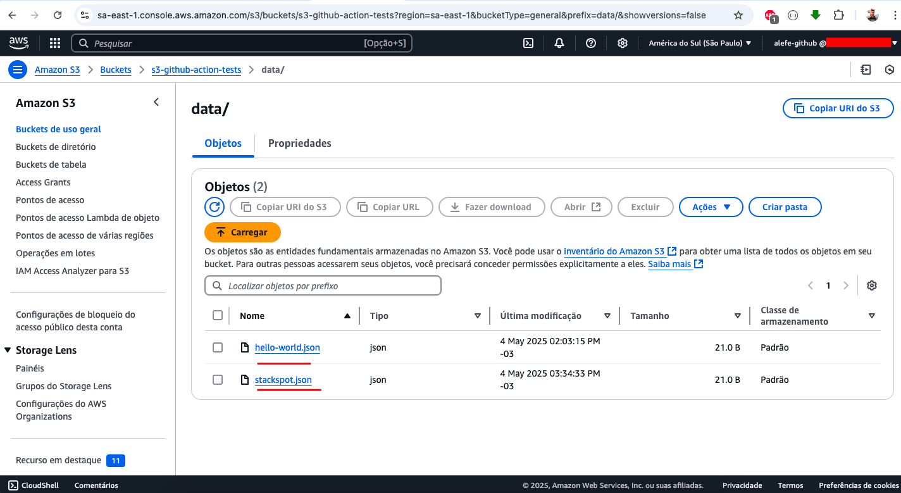
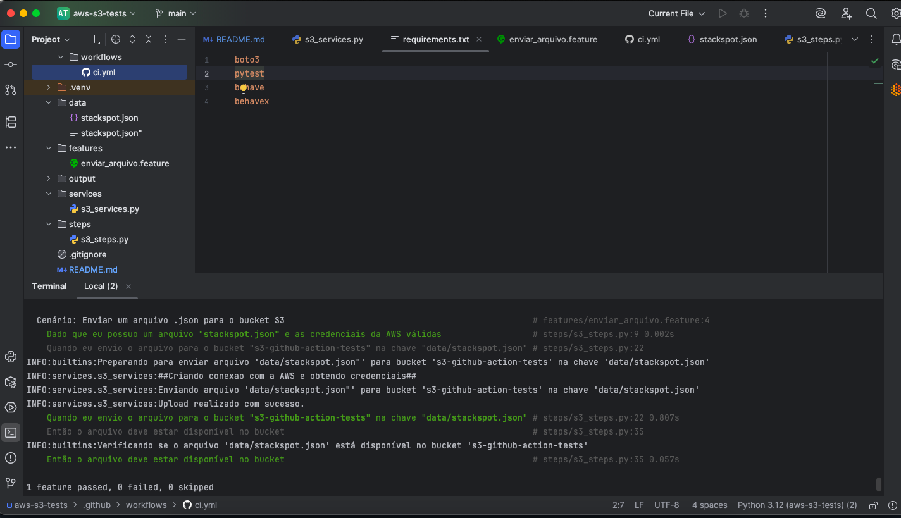
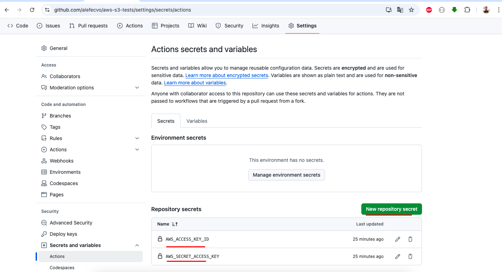
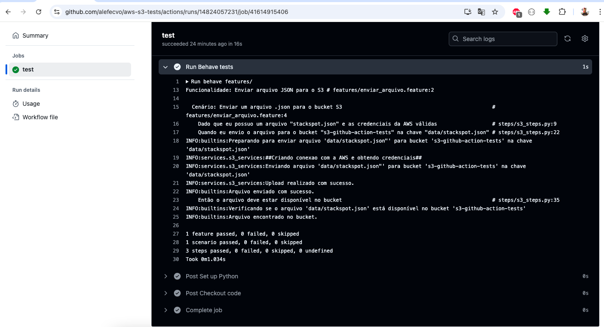

# aws-s3-tests

Este é um exemplo básico de um projeto de automação de testes enviando arquivo .json para bucket S3 da AWS usando Python, `behave` e `boto3`.

Vamos la.

## Estrutura do Projeto

- `features/`: Contém os arquivos de testes para enviar arquivo .JSON para bucket S3.
- `steps/`: Contém a implementação dos passos do teste, conectando na aws, enviando arquivo para bucket S3.
- `services/`: Contém a implementação do envio para bucket S3.
- `requirements.txt`: Lista de dependências do projeto.
- `README.md`: Documentação do projeto.

## Como Executar Local

1. Fazer clone do projeto:
    ```bash
    git clone https://github.com/alefecvo/aws-s3-tests.git
    ```

2. Instalar as dependências:
    ```bash
    pip install -r requirements.txt
    ```
   
3. Setar credenciais da AWS no terminal via linha de comando:
    ```bash
    export AWS_ACCESS_KEY_ID='XXXX'
    export AWS_SECRET_ACCESS_KEY='XXXX'
    ```
   
   
4. Criar e definir nome do bucket S3 na AWS:
    ```bash
    bucket-name: s3-github-action-tests
    region: us-east-1
    ```   
   

3. Executar os testes no terminal via linha comando:
    ```bash
    behave features/
    ```
   


## Como Executar na Pipeline

1. Fazer clone do projeto:
    ```bash
    git clone https://github.com/alefecvo/aws-s3-tests.git
    ```

2. Setar credenciais da AWS no github:
    ```bash
    export AWS_ACCESS_KEY_ID='XXXX'
    export AWS_SECRET_ACCESS_KEY='XXXX'
    ```
   

3. Criar e definir nome do bucket S3 na AWS:
    ```bash
    bucket-name: s3-github-action-tests
    region: us-east-1
    ```   
   

4. Subir pro seu repositório e acompanhar execucão via github actions:
 
   
